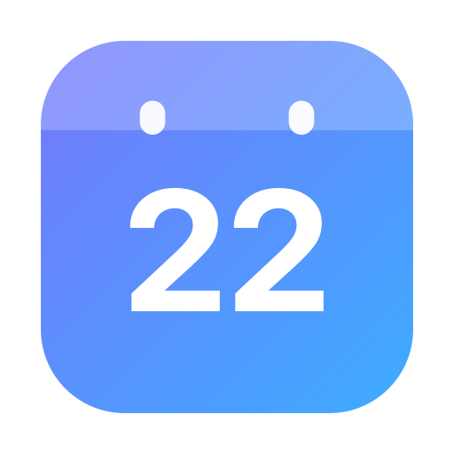

<div align="center">



# CalBar

**A compact calendar that lives in your macOS menu bar — built with Liquid Glass.**

<br>


</div>

---

CalBar is a lightweight, native macOS menu bar calendar written entirely in Swift (AppKit + SwiftUI). It stays out of your way — no Dock icon, no windows — and gives you a beautiful month view one click away from anywhere.

## ✨ Features

### 🗓 Menu Bar Presence
- Custom-drawn **calendar badge icon with today's date knocked out**, rendered as a template image so it adapts perfectly to light & dark menu bars
- Crisp at 1x and 2x (Retina), updates automatically at midnight
- Left-click opens the panel · right-click opens a quick menu

### 📅 Month View
- Full month grid with leading/trailing days dimmed
- **Today** highlighted with an indigo→cyan gradient pill
- Selected day outlined, hover states on every cell
- Previous / next month chevrons + a gradient **Today** button for instant jump back
- Week start toggle: **Sun / Mon**

### 🎯 Go to Date
- Dedicated picker card: month dropdown + year field + day stepper
- Invalid dates auto-clamp (e.g. *Feb 30 → Feb 28*) when you change month/year
- Jumps straight to any date, past or future

### 📝 Quick Events
- Select any day and type to add events — stored locally in `UserDefaults`
- Days with events show a small gradient dot under the number
- Delete events with a hover reveal; count badge per selected day

### 🧠 10-Second Memory
CalBar remembers where you were — briefly:
1. Browse anywhere (e.g. 5 months ahead) and **close the panel**
2. **Reopen within 10 seconds** → you land exactly where you left off *(even after a full quit/relaunch)*
3. **Reopen after 10 seconds** → it's back on today, ready for a fresh glance
4. The countdown starts when the panel closes — while it's open you can browse as long as you like without anything jumping around

### 🪟 Liquid Glass Design
- Floating glass tiles composed in a `GlassEffectContainer` — header, grid, event card, footer
- Interactive glass on day cells, gradient accents throughout
- Native macOS 26 Liquid Glass rendering with an `ultraThinMaterial` fallback for macOS 13–25

### ⚙️ System Integration
- **Launch at Login** via `SMAppService` (toggle in the footer or right-click menu), enabled by default
- True menu bar agent (`LSUIElement`) — no Dock icon, no main window
- Single-instance guard prevents duplicate status items
- Zero third-party dependencies · ~800 lines of Swift

## 📦 Installation

### Download the release (recommended)
1. Grab the latest `CalBar.dmg` from [**Releases**](https://github.com/nisarganag/Calendar/releases)
2. Open the DMG and drag **CalBar.app → Applications**
3. Launch it once from `/Applications` — this makes sure the login item points at the permanent path
4. Look for the date badge in your menu bar 🎉

> The app is ad-hoc signed (no Apple Developer ID). If Gatekeeper complains on another Mac, right-click → **Open**, or allow it in *System Settings → Privacy & Security*.

### Build from source
Requires **Xcode Command Line Tools** (`swiftc`, `iconutil`, `hdiutil`) on macOS 13+:

```bash
git clone https://github.com/nisarganag/Calendar.git
cd Calendar
./build.sh
```

The script compiles the Swift sources, renders the app icon set, bundles `build/CalBar.app`, ad-hoc codesigns it, and drops both `dist/CalBar.app` and `dist/CalBar.dmg`.

## 🚀 Usage

| Action | Result |
|---|---|
| Click the date badge | Toggle the calendar panel |
| Right-click the badge | Quick menu: Launch at Login · Quit |
| `‹` / `›` | Previous / next month |
| **Today** pill | Snap back to today |
| Clock-calendar icon | Open the Go-to-Date card |
| Click any day | Select it → add/view its events |
| Type + `↩` | Add an event to the selected day |
| Hover an event | Reveal delete button |
| Sun/Mon switcher | Change week start |
| Login toggle | Enable/disable launch at login |
| Power icon | Quit CalBar |

## 🏗 Project Structure

```
Calendar/
├── Sources/
│   ├── main.swift               # Entry point + single-instance guard
│   ├── AppDelegate.swift        # Status item, popover, menus, timers
│   ├── StatusBarIcon.swift      # Programmatic template-icon renderer
│   ├── CalendarViewModel.swift  # Grid math, events store, grace logic, login item
│   └── CalendarViews.swift      # SwiftUI panel (Liquid Glass UI)
├── Scripts/
│   └── generate_icon.swift      # App icon generator (CoreGraphics → .iconset)
├── Resources/
│   └── Info.plist               # Bundle config (LSUIElement agent app)
├── assets/                      # README artwork
└── build.sh                     # One-command build → .app + .dmg
```

## 🔧 How It Works

- **Grid**: computed from `Calendar.current` — weekday offset for the configured week start, always rendered as 6×42 cells with adjacent-month fillers
- **Events**: `[yyyy-MM-dd: [String]]` dictionary persisted in `UserDefaults`; mutations save-through
- **Grace window**: the browsed month and selection are persisted with a timestamp taken when the panel closes (or the app quits); on the next open, anything older than 10 s resets to today
- **Status icon**: drawn at runtime into 1x+2x bitmap reps, `.isTemplate = true`, digits punched out via `destinationOut` compositing
- **Login item**: `SMAppService.mainApp.register()` (macOS 13+ ServiceManagement), re-synced against system state on every launch

## 🗺 Roadmap

- [ ] Natural-language date entry ("next friday")
- [ ] Event reminders via `UNUserNotificationCenter`
- [ ] Multiple calendars / colors
- [ ] Keyboard navigation (arrow keys, ⇥ between cards)
- [ ] Universal binary (Intel)

## 📄 License

Released under the [MIT License](LICENSE) — © 2026 Nisarga Nag.
